# BOS AIDE Knowledge-Centric Loop Engineering

## Architecture and Detailed Design

**Subtitle:** Graph-Governed Spec-Driven Development for Single- and Multi-Microservice Delivery  
**Version:** 1.0.1  
**Date:** 20 August 2026  
**Deployment baseline:** Native Windows 11 x64

---

## 1. Executive summary

BOS AIDE Knowledge-Centric Loop Engineering combines three disciplines:

1. **Spec-Driven Development** defines the destination: requirements, design, tasks, acceptance criteria, and traceability.
2. **Loop Engineering** executes bounded Goal -> Action -> Observation -> Adjustment cycles until deterministic evidence produces PASS, a decision requires ESCALATE, or limits produce FAIL.
3. **Graph Engineering** provides connected enterprise context: services, repositories, APIs, events, schemas, data, user flows, tests, ADRs, owners, deployments, incidents, and provenance.

A multi-service change does not use one unrestricted global coding loop. It starts with one enterprise specification and graph-derived impact context, derives one local specification per affected service, and executes separate service, contract, integration, and E2E loops.

The Knowledge Plane is Markdown-first:

- Git-backed `wiki/` pages are governed artifacts.
- Neo4j is the exact typed relationship index.
- Graphiti adds temporal and semantic context.
- OpenWiki compiles user-readable documentation.
- Kiro retrieves bounded context through indexed resources and a custom MCP server.
- Only reviewed and merged outcomes become canonical learning.

---

## 2. Architecture principles

1. Kiro proposes; deterministic gates and human-governed delivery systems decide.
2. Markdown is durable; the graph is rebuildable.
3. Deterministic extraction precedes LLM synthesis.
4. Declared, contracted, implemented, and observed evidence remain distinct.
5. Context is assembled for the task, not dumped wholesale.
6. Loops have explicit scope, gates, budgets, escalation, and terminal states.
7. The enterprise orchestrator coordinates and routes; it does not edit all repositories freely.
8. OpenWiki and temporal memory are derived and lower trust.
9. Learning is merge-gated.
10. The exact graph remains usable when Graphiti or an LLM provider is unavailable.

---

## 3. Goals and non-goals

### Goals

- Support new and legacy systems from one repository to enterprise service graphs.
- Keep knowledge predominantly in Markdown.
- Give Kiro exact contract and schema evidence.
- Provide graph-based impact analysis and failure routing.
- Bound agent execution and cost.
- Preserve provenance and history.
- Generate readable documentation without weakening authority.
- Run natively on Windows without containers.

### Non-goals

- Fine-tune a model on every source change.
- Replace Git, CI, Jira, architecture review, or CODEOWNERS.
- Allow Kiro to deploy directly to production.
- Treat OpenWiki, Graphiti, or Mem0 as canonical truth.
- Add a separate vector platform before scale measurements justify it.

---

## 4. Operating model

### Single microservice

```text
Feature Spec -> task loop -> service loop -> deterministic gates -> PR -> approved learning
```

### Multiple microservices

```text
Enterprise Spec -> graph impact/context -> bounded service-local specs
-> service loops -> contract loop -> integration loop -> E2E loop
-> coordinated PRs -> approved learning
```

---

## 5. System context

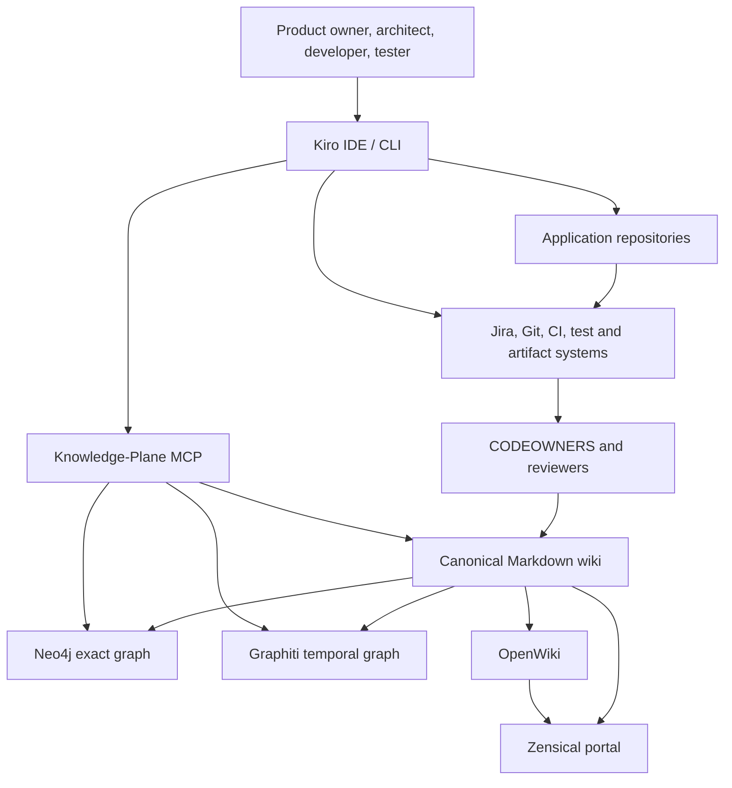

---

## 6. Layered reference architecture

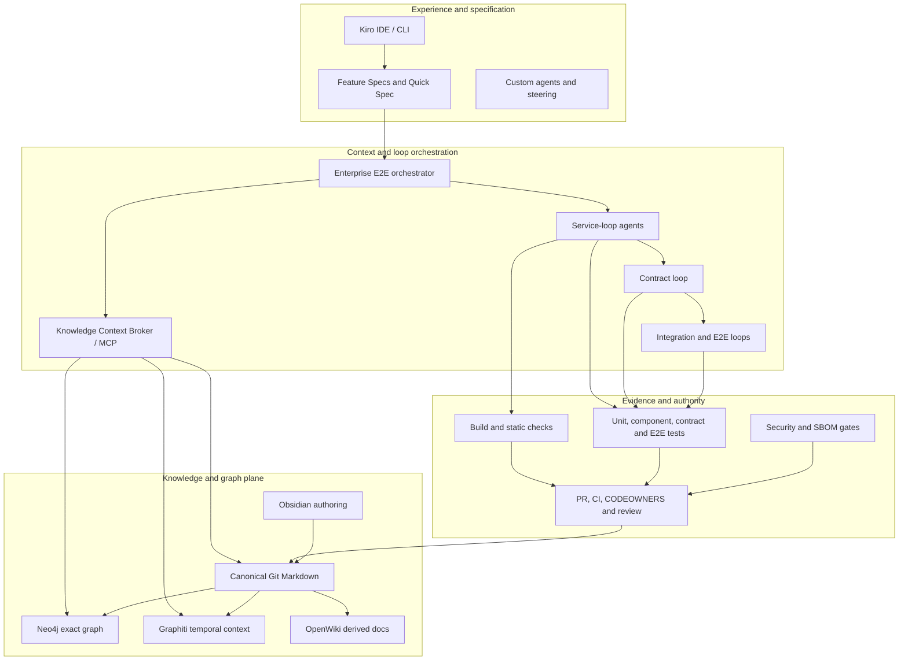

---

## 7. Final component stack

| Capability | Choice | Architectural role |
|---|---|---|
| Specification | Kiro Feature Specs | Requirements, design, tasks and acceptance traceability |
| Loop orchestration | Kiro agents + YAML contracts + CI | Bounded execution and deterministic termination |
| Canonical knowledge | Git Markdown + YAML | Governed, human-readable knowledge |
| Exact graph | Neo4j 5.26 LTS | Typed traversal and deterministic provenance |
| Temporal graph | Graphiti | Changing facts, episodes and hybrid retrieval |
| Context interface | Custom MCP server | Policy boundary between Kiro and knowledge systems |
| Documentation | OpenWiki + Zensical | Derived explanations and Mermaid portal |
| Authoring | Obsidian | Human navigation and editing |
| Authority | Git/Jira/CI/CODEOWNERS | Acceptance and publication control |

---

## 8. Loop state model

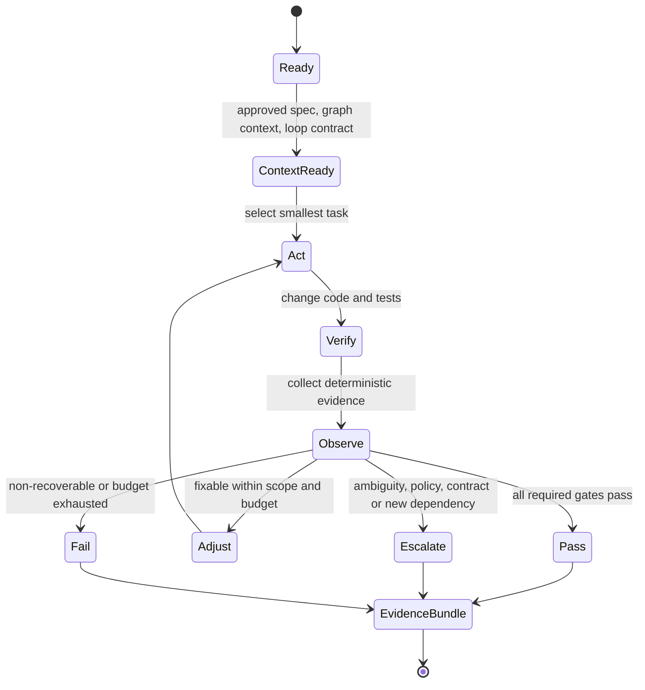

Every loop contract defines goal, allowed repositories and paths, forbidden actions, escalation conditions, verification gates, budgets, and exactly three terminal states.

---

## 9. Single-service sequence

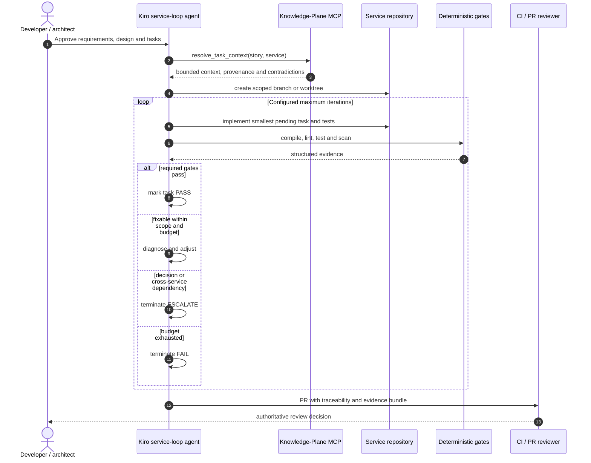

---

## 10. Multi-service nested loops

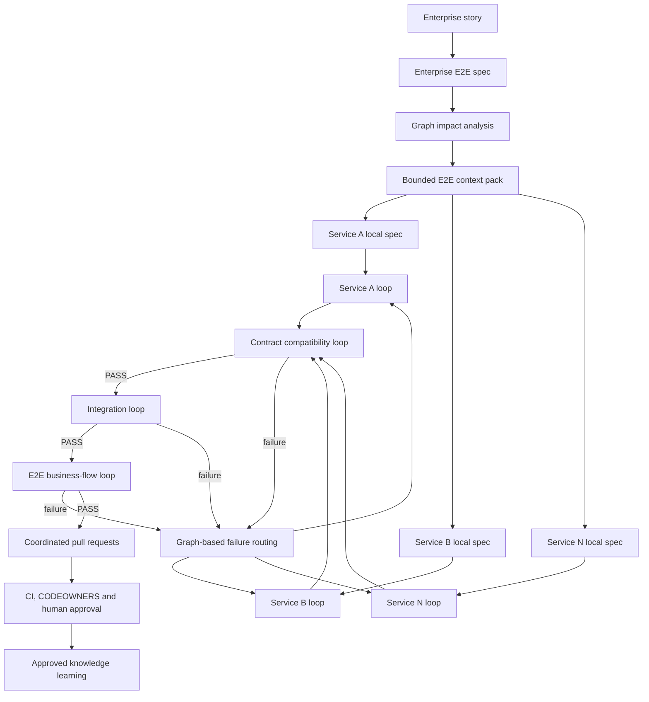

---

## 11. Enterprise orchestration sequence

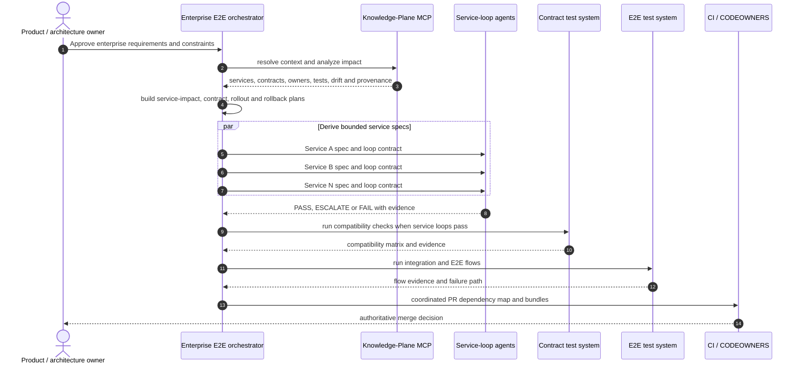

---

## 12. Graph Engineering lifecycle

Graph Engineering comprises:

1. Ontology engineering.
2. Deterministic extraction.
3. Entity resolution.
4. Relationship and provenance validation.
5. Context retrieval and impact analysis.
6. Graph evolution after approved delivery.

It is not merely loading Markdown into Neo4j.

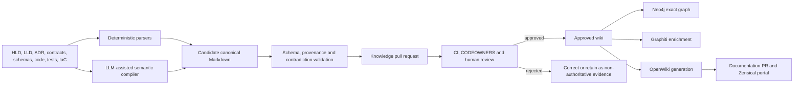

---

## 13. Context assembly

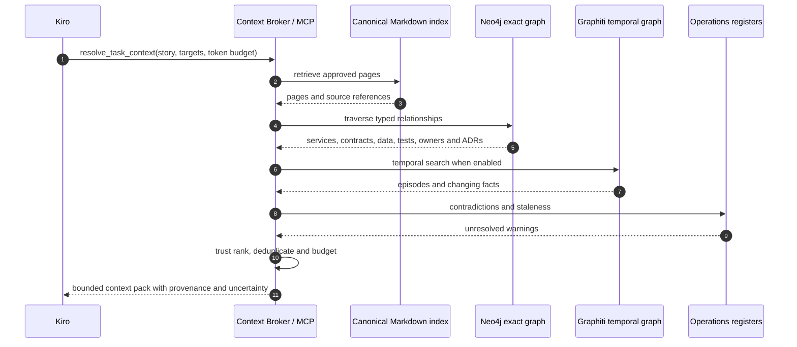

Context packs are disposable views, not canonical knowledge.

---

## 14. Context-pack model

```text
generated/context-packs/<story-id>/
|-- objective.md
|-- acceptance-criteria.md
|-- affected-services.md
|-- user-flow.md
|-- current-contracts.md
|-- data-impact.md
|-- code-entry-points.md
|-- relevant-adrs.md
|-- existing-tests.md
|-- dependency-order.md
|-- rollout-and-rollback.md
|-- contradictions.md
`-- provenance.md
```

---

## 15. Core ontology

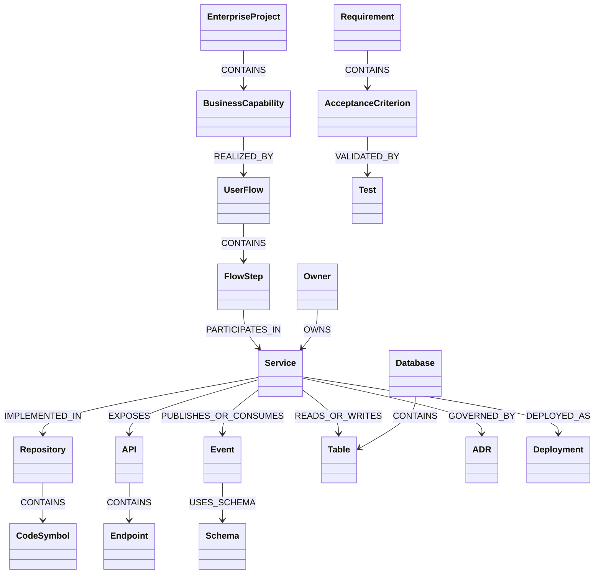

Every fact should preserve source, commit, location or pointer, evidence class, confidence, review status, validity interval, last verification, extractor, and access scope.

---

## 16. Contract change sequence

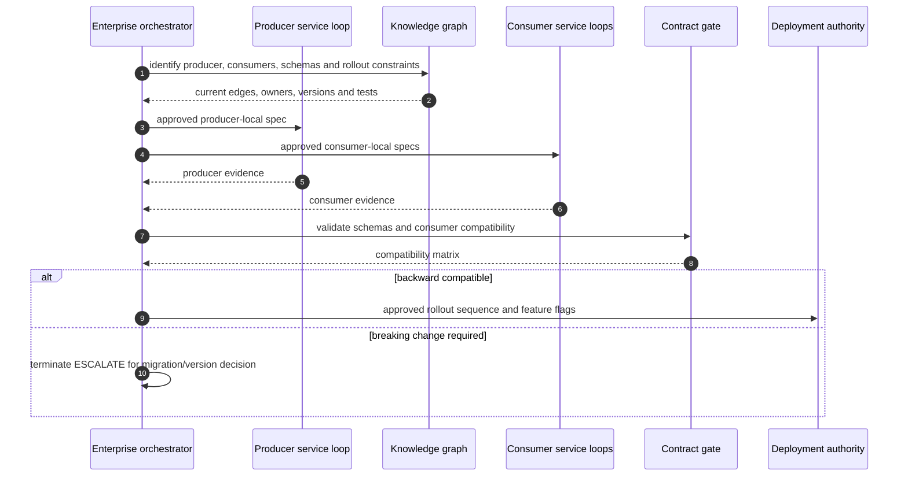

---

## 17. Self-learning model

Self-learning means evidence-driven improvement of knowledge and procedure, not unsupervised rewriting of architectural truth.

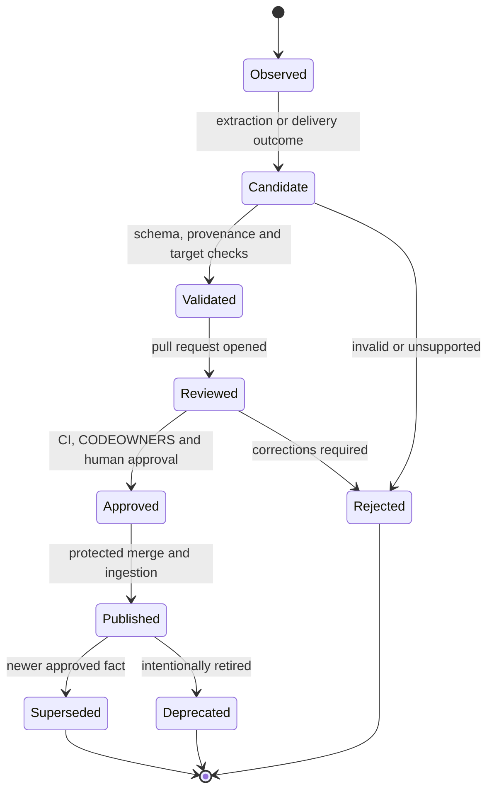

| Learning domain | Examples | Rule |
|---|---|---|
| Semantic knowledge | APIs, schemas, dependencies, ownership | Source-backed PR required |
| Episodic memory | Attempt, incident, task discussion | Advisory and retention-controlled |
| Procedural knowledge | Testing or migration convention | Promote to steering after reviewed evidence |
| Retrieval learning | Query misses and accepted context | Improve ranking, not canonical facts |

---

## 18. Trust and security boundaries

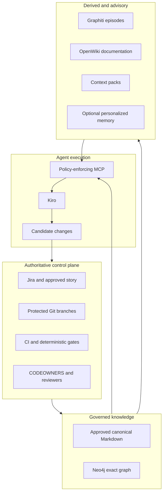

The transition from candidate changes to authority always crosses validation and human review.

---

## 19. Windows native deployment

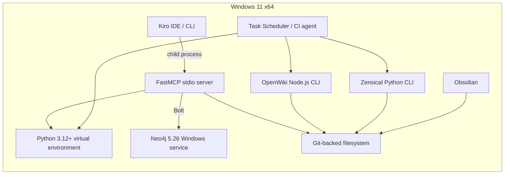

---

## 20. MCP design

Read tools:

```text
health
list_knowledge_pages
read_knowledge_page
get_entity
search_knowledge
trace_dependencies
analyze_change_impact
resolve_task_context
list_contradictions
```

Controlled write tool:

```text
propose_knowledge_delta
```

The write tool may create a candidate only under `generated/candidates/`. It cannot write to `wiki/`, merge a branch, or publish graph facts.

---

## 21. OpenWiki architecture

```text
Approved wiki and source evidence
    -> OpenWiki generation
    -> openwiki/ derived Markdown
    -> documentation PR
    -> review
    -> Zensical portal
```

OpenWiki pages may orient a reader or agent. Exact code, contract, and schema decisions must rely on canonical and source evidence.

---

## 22. Failure routing

| Failure | Required response |
|---|---|
| Local build/test failure | Continue local loop within scope and budget |
| New service dependency | Terminate ESCALATE and update enterprise impact |
| Contract incompatibility | Route to contract loop and owners |
| E2E failure with graph path | Route to responsible service or edge loop |
| Unknown failure owner | ESCALATE and create a knowledge-gap candidate |
| Graphiti provider unavailable | Continue with Markdown and exact Neo4j graph |
| Neo4j unavailable | Stop graph-dependent planning; do not invent impact |
| Contradictory current facts | Surface both with provenance |
| OpenWiki hallucination | Reject derived documentation |
| Loop budget exhausted | Terminate FAIL or ESCALATE; never continue indefinitely |

---

## 23. Observability and evaluation

Collect:

- MCP request count, latency, errors, and tool use.
- Neo4j query latency and result size.
- Graphiti provider cost, latency, and failures.
- Ingestion duration, nodes, edges, contradictions, and staleness.
- Loop iterations, elapsed time, terminal state, gates, files, and credits.
- OpenWiki changed pages and PR acceptance.

Measure:

| Metric | Purpose |
|---|---|
| Context precision and recall | Useful context without missing critical facts |
| Provenance coverage | Claims with resolvable evidence |
| Contract hallucination rate | Invented endpoint/event/field/table references |
| Impact-analysis accuracy | Correct affected services and consumers |
| Loop convergence | PASS rate and iterations |
| Escalation quality | Correct owner, evidence, and decision request |
| Knowledge-delta acceptance | Candidate learning approved after review |
| Delivery outcome | CI, defects, rollback, and lead-time results |

---

## 24. Scalability

### Small service
Use local Kiro specs, bounded loops, direct Markdown indexing, and optionally a lightweight graph.

### Six to seven services
Use the complete design: enterprise spec, Neo4j, Graphiti, MCP, service loops, contract loop, E2E loop, OpenWiki, and merge-gated learning.

### Large legacy estate
Add Tree-sitter/SCIP-style code intelligence, incremental ingestion, repository federation, access-control propagation, and stronger evidence-class separation.

### Enterprise federation
Use globally unique IDs and a shared ontology while allowing domain-owned knowledge repositories and graph groups.

---

## 25. Architecture decisions

### ADR-001 - Git Markdown is canonical
Graphs are rebuildable; publication uses ordinary PR governance.

### ADR-002 - Exact and temporal graphs coexist
Neo4j stores deterministic facts; Graphiti supplies temporal and semantic context.

### ADR-003 - Custom MCP policy facade
Kiro receives task-oriented tools, not unrestricted Cypher or graph administration.

### ADR-004 - Multi-service work uses nested loops
The enterprise orchestrator coordinates bounded service, contract, integration, and E2E loops.

### ADR-005 - OpenWiki is derived
Generated documentation cannot override canonical knowledge.

### ADR-006 - Native Windows baseline
Neo4j runs as a service; Python and Node tools run natively without containers.

### ADR-007 - Zensical for new portals
Use a current Mermaid-capable documentation generator while preserving Markdown portability.

---

## 26. Delivery roadmap

1. Standardize Kiro Feature Specs and deterministic local loops.
2. Normalize canonical Markdown and build the exact Neo4j graph.
3. Add graph-backed impact and bounded service-local specs.
4. Add contract, integration, and E2E loops.
5. Enable Graphiti with an approved provider.
6. Add OpenWiki and the Zensical portal.
7. Add access-control propagation, evaluation, and federation.

---

## 27. Architecture acceptance criteria

- [ ] Exact graph rebuilds from approved Markdown.
- [ ] Every published graph fact has provenance and review status.
- [ ] Single-service loops enforce repository, path, gate, and budget scope.
- [ ] Multi-service changes have one enterprise spec and one local spec per affected service.
- [ ] Contract and E2E loops pass before coordinated merge.
- [ ] Kiro cannot silently expand a service loop into another repository.
- [ ] Exact retrieval works during Graphiti/provider degradation.
- [ ] OpenWiki cannot overwrite canonical knowledge.
- [ ] Candidate learning cannot bypass CI and review.
- [ ] The developer topology runs natively on Windows.

---

## 28. Summary

> The specification defines the destination.  
> The graph identifies the connected route and evidence.  
> Bounded loops implement, observe, adjust, and prove the journey.  
> Deterministic gates and humans decide what is accepted and learned.

---

## 29. Primary references

- Kiro Feature Specs: https://kiro.dev/docs/specs/feature-specs/
- Kiro MCP: https://kiro.dev/docs/mcp/
- Kiro custom agents: https://kiro.dev/docs/cli/custom-agents/configuration-reference/
- Neo4j Windows installation: https://neo4j.com/docs/operations-manual/current/installation/windows/
- Graphiti: https://github.com/getzep/graphiti
- MCP Python SDK: https://github.com/modelcontextprotocol/python-sdk
- OpenWiki: https://github.com/langchain-ai/openwiki
- Zensical: https://zensical.org/docs/get-started/
