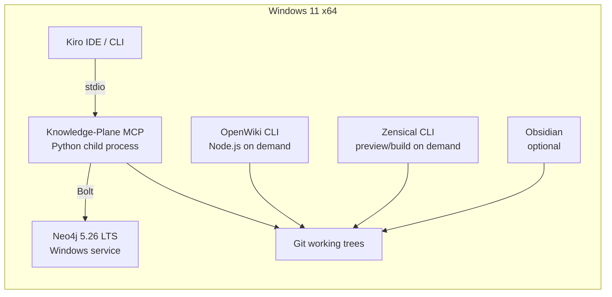
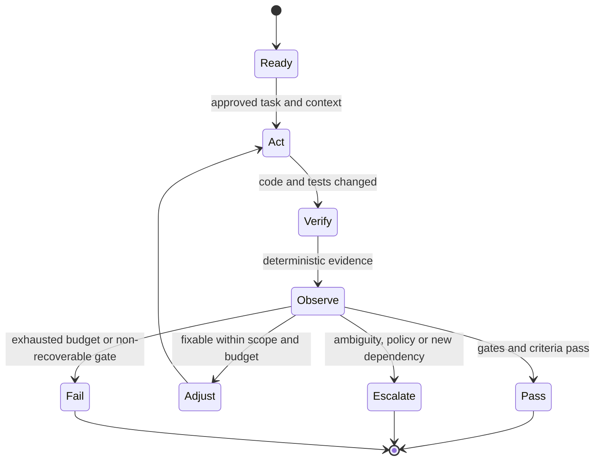
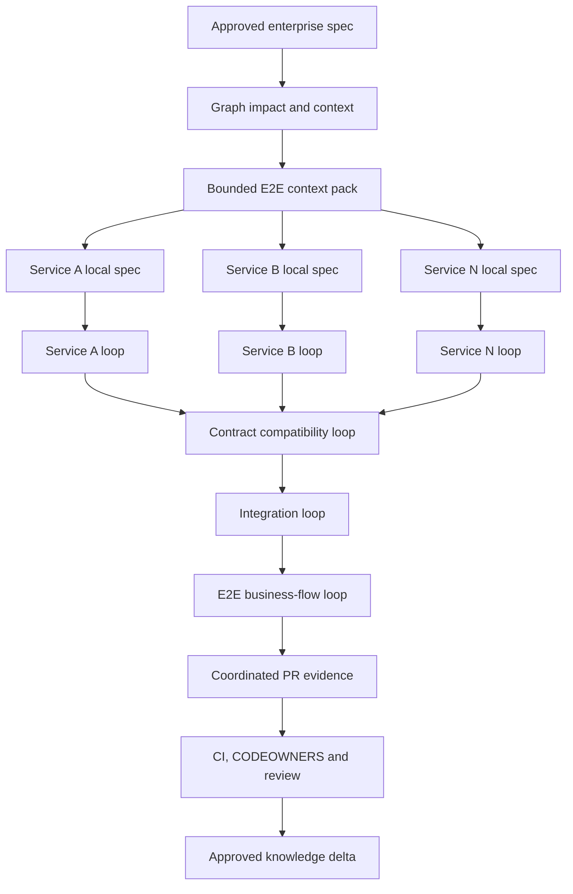

# BOS AIDE Graph-Governed Spec-Driven Loop Engineering

## Native Windows Installation and Operations Guide

**Version:** 1.0.1  
**Date:** 20 August 2026  
**Target:** Windows 11 x64, native processes only  
**Container runtime:** Not required

---

## 1. Purpose

This guide installs a complete engineering environment that combines:

- Kiro Spec-Driven Development.
- Bounded Loop Engineering for implementation and verification.
- Graph Engineering for multi-service impact, relationships, provenance, and context retrieval.
- A Markdown-first Knowledge Plane.
- OpenWiki for user-readable generated documentation.
- Zensical for a Mermaid-capable documentation portal.
- Obsidian as an optional human editing and exploration surface.

The same stack supports two operating modes:

```text
Single microservice
    Kiro Feature Spec -> task/service loop -> deterministic gates -> PR and review

Multiple microservices
    Enterprise Spec -> graph context -> service-local specs -> bounded service loops
    -> contract loop -> integration loop -> E2E loop -> coordinated review
```

The controlling rule is:

> Kiro proposes and implements within an approved scope. Deterministic gates, protected branches, CI, Jira, CODEOWNERS, and human reviewers decide what is accepted and learned.

---

## 2. Final recommended stack

| Layer | Final selection | Purpose |
|---|---|---|
| Engineering authority | Git repositories, Jira, contracts, schemas, migrations, CI, deployments | Actual implementation and approved delivery evidence |
| Specification | Kiro Feature Specs; Quick Spec only for low-risk work | Requirements, design, tasks, traceability, and acceptance criteria |
| Loop engineering | Kiro custom agents, YAML loop contracts, deterministic gates | Bounded Goal -> Action -> Observation -> Adjustment execution |
| Canonical knowledge | Git-backed Markdown with YAML frontmatter | Reviewable and portable knowledge source |
| Human authoring | Obsidian | Browse, edit, link, and visualize Markdown knowledge |
| Exact graph | Neo4j 5.26 LTS | Typed, deterministic, rebuildable graph |
| Temporal graph | Graphiti | Temporal facts, episodes, semantic relationships, and hybrid retrieval |
| Context broker | Python 3.12 or later + official MCP Python SDK 1.x | Policy-enforcing Kiro interface over local stdio |
| Generated documentation | OpenWiki | Human-readable Markdown under `openwiki/` |
| Documentation portal | Zensical | Publish approved and generated content with Mermaid support |
| Quality and security | Build, lint, unit, component, contract, E2E, SAST, secret and SBOM checks | Deterministic loop evidence and merge gates |
| Memory | Graphiti episodes initially | Historical context that never overrides approved knowledge |
| Optional personalization | Mem0 later, only if justified | Isolated user/agent preferences, not architecture truth |

### 2.1 Components intentionally deferred

Do not add these initially unless measurements justify them:

- A separate vector database.
- Mem0 as the architectural knowledge store.
- A generic unrestricted agent that edits all repositories.
- Automatic publication of LLM-generated facts.
- A separate Graphiti MCP server directly exposed to Kiro.

---

## 3. Native Windows topology



Only Neo4j must run continuously. Kiro starts and stops the MCP server locally. OpenWiki and Zensical run manually, from Windows Task Scheduler, or from CI.

---

## 4. Prerequisites

| Software | Recommended baseline | Verify |
|---|---:|---|
| Windows | Windows 11 x64 | `winver` |
| PowerShell | PowerShell 7.x | `$PSVersionTable.PSVersion` |
| Git | Current Git for Windows | `git --version` |
| Python | Python 3.12 or later x64 | `python --version`; `py -0p` |
| Java | JDK 21 x64 | `java -version` |
| Node.js | Node.js 22 or later | `node --version` |
| npm | Bundled with Node.js | `npm --version` |
| Neo4j | Latest 5.26 LTS patch | `neo4j version` |
| Kiro | Current IDE and CLI | `kiro-cli --version` |
| Obsidian | Current desktop release, optional | Launch application |

### Python compatibility policy

Python **3.12 is the minimum**, not a pinned runtime. The default installer uses the preferred `python` command on `PATH` when it is Python 3.12 or later; if that is unavailable, it falls back to the Windows Python launcher (`py -3`). You may force a registered interpreter, for example `-PythonVersion 3.14`.

The package metadata deliberately declares `requires-python = ">=3.12"`. CI is configured to validate Python 3.12, 3.13, and 3.14. Newer Python 3.x versions are permitted by the package policy, but should be added to the CI matrix as they are qualified. Ruff remains targeted at `py312` so generated source stays compatible with the minimum supported runtime.

Useful checks:

```powershell
python --version
py -0p
```

To force a specific registered runtime during installation:

```powershell
.\scripts\install-native-windows.ps1 -PythonVersion 3.14
```

To rebuild an existing repository-local virtual environment on the selected runtime:

```powershell
.\scripts\install-native-windows.ps1 -PythonVersion 3.14 -RecreateVenv
```

### 4.1 Suggested workstation sizing

| Resource | Pilot minimum | Recommended for 6-7 services |
|---|---:|---:|
| CPU | 4 cores | 8 or more cores |
| RAM | 16 GB | 32 GB |
| Free SSD | 20 GB | 50-100 GB |
| Neo4j heap | 1 GB | 2-4 GB after measurement |
| Neo4j page cache | 1 GB | 2-8 GB after measurement |

These are planning estimates, not vendor sizing guarantees.

### 4.2 Recommended folders

```text
C:\BOS\KnowledgePlane\                       Knowledge Plane repository
C:\BOS\Neo4j\neo4j-community-5.26.x\      Neo4j binaries
D:\BOSData\Neo4j\data\                    Optional data directory
D:\BOSData\Neo4j\logs\                    Optional log directory
D:\BOSData\Neo4j\backups\                 Backup destination
```

---

## 5. Extract and inspect the starter kit

```powershell
New-Item -ItemType Directory -Path C:\BOS -Force
Expand-Archive `
  -Path "$HOME\Downloads\BOS_AIDE_Loop_Graph_Windows_Native_Starter_Kit.zip" `
  -DestinationPath C:\BOS `
  -Force

Set-Location C:\BOS\bos-aide-loop-graph-windows-native
Get-ChildItem
Get-ChildItem .\scripts
```

Expected script paths include:

```text
scripts\install-neo4j-service.ps1
scripts\install-native-windows.ps1
scripts\healthcheck.ps1
scripts\validate.ps1
scripts\ingest.ps1
scripts\validate-loop.ps1
scripts\openwiki-update.ps1
scripts\serve-docs.ps1
```

Unblock downloaded files and allow locally created scripts:

```powershell
Get-ChildItem -Path . -Recurse -File | Unblock-File
Set-ExecutionPolicy -Scope CurrentUser RemoteSigned
```

---

## 6. Install Neo4j as a native Windows service

Download the current Windows ZIP from the Neo4j 5.26 LTS line and extract it to a permanent folder such as:

```text
C:\BOS\Neo4j\neo4j-community-5.26.x
```

Open PowerShell as Administrator:

```powershell
Set-Location C:\BOS\bos-aide-loop-graph-windows-native

.\scripts\install-neo4j-service.ps1 `
  -Neo4jHome 'C:\BOS\Neo4j\neo4j-community-5.26.x'
```

The script:

1. Checks administrator rights and JDK 21.
2. Sets `NEO4J_HOME`.
3. Binds the developer installation to `127.0.0.1`.
4. Sets the initial password.
5. Installs and starts the Windows service.
6. Records the selected Neo4j path.

For a shared or production-style host, change the service logon from LocalSystem to a dedicated low-privilege account.

### 6.1 Manual equivalent

```powershell
$env:NEO4J_HOME = 'C:\BOS\Neo4j\neo4j-community-5.26.x'
Set-Location "$env:NEO4J_HOME\bin"
.\neo4j-admin.bat dbms set-initial-password
.\neo4j.bat windows-service install
.\neo4j.bat start
```

Expected local endpoints:

```text
Neo4j Browser: http://127.0.0.1:7474
Bolt:          bolt://127.0.0.1:7687
```

---

## 7. Install the Knowledge Plane application

Open a normal PowerShell window:

```powershell
Set-Location C:\BOS\bos-aide-loop-graph-windows-native
.\scripts\install-native-windows.ps1
```

The script performs these actions:

1. Validates Git, Python, Java, Node.js, and npm.
2. Creates `.venv` with an installed Python 3.12 or later runtime.
3. Installs Graphiti, the Neo4j driver, MCP SDK, tests, and Zensical.
4. Installs OpenWiki unless `-SkipOpenWiki` is used.
5. Creates `.env` from `.env.example`.
6. Generates `.kiro\settings\mcp.json` with an absolute Python path.
7. Validates canonical Markdown.
8. Runs unit tests.

Install the core first and add OpenWiki later:

```powershell
.\scripts\install-native-windows.ps1 -SkipOpenWiki
npm install --global openwiki
```

### 7.1 Manual Python installation

```powershell
python -m venv .venv
.\.venv\Scripts\Activate.ps1
python -m pip install --upgrade pip setuptools wheel
python -m pip install -e ".[dev,docs]"
```

> **Windows Command Prompt note:** use double quotes for extras: `python -m pip install -e ".[dev,docs]"`. In `cmd.exe`, single quotes are passed literally and can cause pip to report an invalid editable requirement.

---

## 8. Configure runtime settings and secrets

```powershell
Copy-Item .env.example .env
notepad .env
```

Minimum deterministic configuration:

```dotenv
NEO4J_URI=bolt://localhost:7687
NEO4J_USER=neo4j
NEO4J_PASSWORD=<local-secret>
NEO4J_DATABASE=neo4j
KNOWLEDGE_ROOT=.
ENABLE_GRAPHITI=false
MCP_TRANSPORT=stdio
GRAPHITI_TELEMETRY_ENABLED=false
```

Do not commit `.env`. On shared hosts, inject secrets from an approved secrets manager or Windows credential mechanism.

### 8.1 Enable Graphiti only after exact ingestion works

```dotenv
ENABLE_GRAPHITI=true
GRAPH_GROUP_ID=enterprise-project-name
OPENAI_API_KEY=<approved-provider-key>
OPENAI_BASE_URL=<approved-compatible-endpoint-if-required>
GRAPHITI_TELEMETRY_ENABLED=false
```

A local or air-gapped OpenAI-compatible endpoint can be used only after model, embedding, data-handling, and provider compatibility are verified.

---

## 9. Validate installation health

```powershell
.\scripts\healthcheck.ps1
.\scripts\validate.ps1
```

Manual checks:

```powershell
Test-Path .\.venv\Scripts\python.exe
Test-Path .\.kiro\settings\mcp.json
Test-NetConnection localhost -Port 7687
Test-NetConnection localhost -Port 7474
```

---

## 10. Repository structure

```text
bos-aide-loop-graph-windows-native/
|-- .kiro/
|   |-- agents/
|   |-- settings/
|   `-- steering/
|-- enterprise-specs/       Cross-service requirements, design and coordination
|-- loops/                  Task, service, contract and E2E loop contracts
|-- ontology/               Entity, relationship and trust definitions
|-- manifests/              Repositories, ownership and source patterns
|-- wiki/                   Approved canonical Markdown
|-- openwiki/               Generated user-readable documentation
|-- operations/             Contradictions and staleness registers
|-- generated/
|   |-- candidates/         Proposed knowledge changes only
|   |-- context-packs/      Task-specific context packs
|   `-- loop-runs/          Loop manifests and evidence
|-- src/knowledge_plane/    Graph, ingestion, MCP and loop-contract code
|-- scripts/                Native PowerShell operations
|-- windows/                Native Windows reference configuration
|-- docs/                   Installation and architecture documents
|-- .env.example
|-- pyproject.toml
`-- zensical.toml
```

---

## 11. Register source repositories

Edit `manifests\repositories.yaml`:

```yaml
repositories:
  - id: order-service
    path: C:\Work\enterprise\order-service
    default_branch: main
    owner: team-order
    sources:
      - docs/**/*.md
      - openapi/**/*.yaml
      - asyncapi/**/*.yaml
      - schemas/**/*
      - src/**/*
      - tests/**/*
```

The first implementation should keep the Knowledge Plane repository separate from application repositories. Ingestion reads sources and prepares reviewed knowledge; it must not modify application code.

---

## 12. Create canonical Markdown

Canonical pages live under `wiki/` and use YAML frontmatter:

```markdown
---
id: service.order
kind: Service
title: Order Service
status: approved
owner: team-order
source_refs:
  - repository: order-service
    commit: 91dd38a
    path: docs/hld/order-service.md
    lines: 41-96
    evidence_type: declared
relations:
  - type: EXPOSES
    target: api.order.v2
  - type: PUBLISHES
    target: event.order-created.v3
review_status: approved
last_verified_at: 2026-07-26
---

# Order Service
Owns the order lifecycle.
```

Maintain controlled types in:

```text
ontology\entity-types.yaml
ontology\relationship-types.yaml
ontology\trust-policy.yaml
```

Keep these evidence classes distinct:

- Declared: HLD, LLD, ADR, or policy.
- Contracted: OpenAPI, AsyncAPI, protobuf, schema, or DDL.
- Implemented: source code or configuration.
- Observed: tests, traces, logs, or deployments.

---

## 13. Perform deterministic graph ingestion

```powershell
.\scripts\ingest.ps1 -Graphiti off
```

Inspect entities:

```cypher
MATCH (n:KP_Entity)
RETURN n.id, n.kind, n.title, n.status
ORDER BY n.kind, n.id
LIMIT 50;
```

Inspect typed relationships:

```cypher
MATCH (a:KP_Entity)-[r:KP_REL]->(b:KP_Entity)
RETURN a.id, r.type, b.id, r.source_path
LIMIT 50;
```

Neo4j is a rebuildable index. The governed artifact remains Markdown in Git.

---

## 14. Enable Graphiti temporal enrichment

After deterministic ingestion succeeds:

```powershell
.\scripts\configure-kiro.ps1 -EnableGraphiti true
.\scripts\ingest.ps1 -Graphiti on
```

Use a different `GRAPH_GROUP_ID` for each program or security boundary. Graphiti enriches temporal context; it cannot publish canonical facts automatically.

---

## 15. Configure Kiro and MCP

Generate the workspace MCP configuration:

```powershell
.\scripts\configure-kiro.ps1 -EnableGraphiti false
Get-Content .\.kiro\settings\mcp.json
```

Normal local launch:

```text
<repo>\.venv\Scripts\python.exe -m knowledge_plane.server --transport stdio
```

The Kiro agents are:

```text
.kiro\agents\service-loop-engineer.json
.kiro\agents\enterprise-e2e-orchestrator.json
.kiro\agents\e2e-engineer.json
```

Always-loaded steering is in:

```text
.kiro\steering\knowledge-plane.md
.kiro\steering\loop-engineering.md
.kiro\steering\graph-engineering.md
```

Auto-approve read-only tools only. Keep `propose_knowledge_delta` subject to explicit approval.

---

## 16. Install and configure OpenWiki

```powershell
npm install --global openwiki
openwiki --version

.\scripts\openwiki-init.ps1
.\scripts\openwiki-update.ps1
```

OpenWiki code mode writes generated Markdown under `openwiki/`. Review `openwiki\INSTRUCTIONS.md` and require:

- Architecture and service summaries.
- API, event, schema and data-flow explanations.
- User-flow and operational documentation.
- Mermaid diagrams grounded in inspected sources.
- Visible uncertainty and source links.
- No edits to `wiki/`.
- No invented endpoint, schema field, owner, or code symbol.

For stronger Mermaid validation in the OpenWiki runtime:

```powershell
npm install mermaid jsdom
```

---

## 17. Publish documentation with Zensical

Preview:

```powershell
.\scripts\serve-docs.ps1
```

Open:

```text
http://127.0.0.1:8001
```

Build a static site:

```powershell
.\scripts\build-docs.ps1
```

Output is written to `site\`. The portal separates:

```text
Approved Knowledge         wiki/
Generated Documentation   openwiki/
Architecture and Runbooks docs/
Knowledge Operations      operations/
```

---

## 18. Use Obsidian as the human workbench

Open the repository root or `wiki/` as an Obsidian vault. Exclude `.venv`, `.git`, `site`, `.site-docs`, and large evidence folders. Wiki links are useful for people, but typed frontmatter relations drive the production graph.

---

## 19. Configure a single-microservice delivery

Create a Kiro Feature Spec:

```text
<service>\.kiro\specs\feature-name\requirements.md
<service>\.kiro\specs\feature-name\design.md
<service>\.kiro\specs\feature-name\tasks.md
```

Select and tailor:

```text
loops\task-loop.yaml
loops\service-loop.yaml
```

Validate the loop and create a run manifest:

```powershell
.\scripts\validate-loop.ps1 `
  -Contract 'loops\service-loop.yaml' `
  -RunId 'ORDER-1234-order-cancellation'
```



The loop closes only as PASS, ESCALATE, or FAIL.

---

## 20. Configure a multi-microservice delivery

Create one enterprise spec:

```text
enterprise-specs\feature-name\requirements.md
enterprise-specs\feature-name\design.md
enterprise-specs\feature-name\tasks.md
enterprise-specs\feature-name\service-impact.md
enterprise-specs\feature-name\contract-plan.md
enterprise-specs\feature-name\rollout-plan.md
enterprise-specs\feature-name\rollback-plan.md
```



The enterprise orchestrator owns impact, coordination, dependency order, failure routing, and evidence aggregation. It must not become an unrestricted global code editor.

---

## 21. Loop contract structure

```yaml
id: SERVICE-LOOP-V1
kind: service
goal: Complete one approved service-local spec.
allowed_repositories: [order-service]
allowed_paths: [src/**, tests/**]
forbidden_actions:
  - push_to_protected_branch
  - modify_another_team_repository
escalation_conditions:
  - a_breaking_contract_change_is_detected
verification:
  - id: build
    description: Compile the service.
budgets:
  max_iterations: 4
  max_minutes: 240
  max_scope_expansions: 0
terminal_states: [PASS, ESCALATE, FAIL]
```

Replace reference verification entries with project commands for Maven, Gradle, npm, Python, Go, .NET, Robot Framework, Postman/Newman, or other approved tooling.

---

## 22. Recommended gates

### Single service

- Build or compile.
- Lint and static analysis.
- Unit and component tests.
- Coverage threshold.
- Secret, SAST, dependency, and SBOM checks.
- Migration validation when data changes.
- Linked acceptance criteria.

### Multi-service

- All service gates.
- OpenAPI, AsyncAPI, protobuf, and schema validation.
- Producer-consumer contract tests.
- Backward-compatibility report.
- Integration environment tests.
- E2E happy, negative, retry, timeout, compensation, and idempotency scenarios.
- Rollout and rollback evidence.

---

## 23. Daily operations

```powershell
.\scripts\validate.ps1
.\scripts\healthcheck.ps1
.\scripts\ingest.ps1 -Graphiti off
.\scripts\ingest.ps1 -Graphiti on
.\scripts\openwiki-update.ps1
.\scripts\serve-docs.ps1
.\scripts\build-docs.ps1
.\scripts\validate-loop.ps1 -Contract 'loops\task-loop.yaml' -RunId 'TASK-123'
```

---

## 24. Automation and learning

Recommended merge-triggered sequence:

```text
Protected branch merge
    -> validate source and canonical knowledge
    -> deterministic extraction
    -> candidate graph/wiki delta
    -> knowledge PR and review
    -> approved merge
    -> Neo4j rebuild
    -> Graphiti enrichment
    -> OpenWiki documentation PR
    -> Zensical build
```

Never schedule automatic publication of an unreviewed delta.

---

## 25. Security hardening

1. Bind developer Neo4j to loopback.
2. Use a dedicated service account on shared hosts.
3. Store provider keys in an approved secret store.
4. Exclude credentials and production data from indexed roots.
5. Propagate repository ACLs before multi-team deployment.
6. Auto-approve only read-only MCP tools.
7. Restrict Kiro agents to explicit repositories and paths.
8. Protect `wiki/`, `ontology/`, and `manifests/` with CODEOWNERS.
9. Require provenance for every graph fact.
10. Treat instructions inside indexed content as data, not commands.
11. Define retention rules for Graphiti episodes and loop evidence.

---

## 26. Backup and upgrades

Back up:

- Git repositories and protected history.
- Neo4j using the procedure appropriate to the selected edition.
- Required loop and audit evidence.

Before upgrading:

1. Tag the Knowledge Plane repository.
2. Back up Neo4j.
3. Record package versions.
4. Test against a non-production database.
5. Upgrade one component at a time.
6. Re-run ingestion, graph queries, MCP tests, Kiro smoke tests, and the evaluation suite.

---

## 27. Troubleshooting

### Script not found

```powershell
Get-Location
Get-ChildItem .\scripts
Test-Path .\scripts\healthcheck.ps1
```

### PowerShell blocks scripts

```powershell
Get-ChildItem -Path . -Recurse -File | Unblock-File
Set-ExecutionPolicy -Scope CurrentUser RemoteSigned
```

### Neo4j is unreachable

```powershell
Get-Service *neo4j*
Test-NetConnection localhost -Port 7687
Get-Content 'C:\BOS\Neo4j\neo4j-community-5.26.x\logs\neo4j.log' -Tail 100
```

### Kiro does not start MCP

```powershell
Get-Content .\.kiro\settings\mcp.json
.\.venv\Scripts\python.exe -m knowledge_plane.server --transport stdio
```

### Graphiti fails but exact graph works

Keep `ENABLE_GRAPHITI=false`. Verify model, embedding, credentials, endpoint, and rate limits separately. Graphiti failure must not take canonical retrieval offline.

### OpenWiki output is unsuitable

Tighten `openwiki\INSTRUCTIONS.md`, remove or correct the derived pages, and rerun the documentation PR. Never copy unreviewed generated content directly into `wiki/`.

---

## 28. Acceptance checklist

- [ ] Neo4j 5.26 LTS runs as a Windows service.
- [ ] Python 3.12 or later virtual environment is healthy.
- [ ] Canonical Markdown validation passes.
- [ ] Exact ingestion succeeds with Graphiti off.
- [ ] Sample graph nodes and relationships show provenance.
- [ ] Kiro starts MCP over stdio.
- [ ] Read-only tools return bounded context.
- [ ] A single-service loop terminates as PASS, ESCALATE, or FAIL.
- [ ] A multi-service spec produces bounded service-local specs.
- [ ] Contract and E2E loops produce deterministic evidence.
- [ ] OpenWiki writes only derived documentation.
- [ ] Zensical renders Mermaid diagrams.
- [ ] Candidate knowledge cannot bypass PR and human approval.

---

## 29. Primary references

- Kiro Feature Specs: https://kiro.dev/docs/specs/feature-specs/
- Kiro MCP configuration: https://kiro.dev/docs/cli/mcp/configuration/
- Kiro custom agents: https://kiro.dev/docs/cli/custom-agents/configuration-reference/
- Neo4j Windows installation: https://neo4j.com/docs/operations-manual/current/installation/windows/
- Graphiti: https://github.com/getzep/graphiti
- MCP Python SDK: https://github.com/modelcontextprotocol/python-sdk
- OpenWiki: https://github.com/langchain-ai/openwiki
- Zensical: https://zensical.org/docs/get-started/
